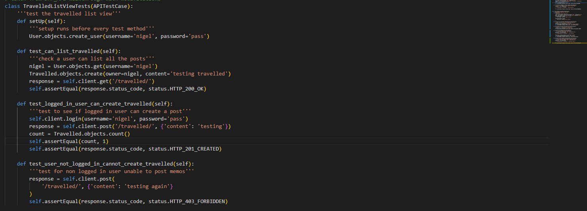
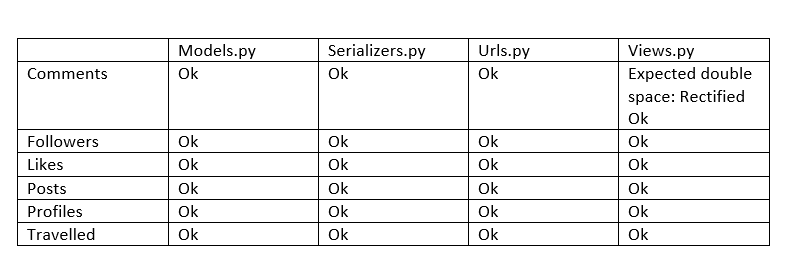

# Testing For Backend TRAVEL-CHECKER-API
back to the [README.md](README.md)

## Contents
1. [Unit Testing](#unit-testing)
    1. [Achievements List View](#achievements-list-view)
    2. [Achievements Detail View](#achievements-detail-view)
    3. [Memo_posts List View](#memo_posts-list-view)
    4. [Memo_posts Detail View](#memo_posts-detail-view)
    5. [Todo List View](#todo-list-view)
    6. [Todo Detail View](#todo-detail-view)
2. [Validator Testing](#validator-testing)
3. [Manual Testing](#manual-testing)
    1. [URL Path tests](#url-path-tests)
    2. [Search and Filter testing](#search-and-filter-testing)
    3. [CRUD Testing](#crud-testing)

## Unit Testing
- I have used API Testcase to test the views using a red, green refactor method.
### Posts List View
- Tests to make sure users can retrieve all posts, a logged in user can update their
post, and a logged out user cannot create a post.

Result image below in with the post detail result.

### Posts Detail View
- Tests to check that a valid id will retrieve a post, an invalid id will not retrieve a post, 
check wether a user can update their own post, and a post cannot be updated by someone
who doesn't own it.

- both results all passed

### Travelled List View
- Tests to make sure users can retrieve Traveled list, a logged in user can update their
Travelled, and a logged out user cannot create a Travelled List.

- Tests Fails

### Travelled Detail View
- Tests to check that a valid id will retrieve a Travelled list, an invalid id will not retrieve a
Travelled list, check wether a user can update their own list, and a list cannot be updated by someone
who doesn't own it.

- Test Failed

## Validator Testing

Ran Pep8 validator testing in terminal Using the following instructions:

- As a workaround, you can add a PEP8 validator to your Gitpod Workspace directly by following these steps:
- Run the command pip3 install pycodestyle  Note that this extension may already be installed, in which case this command will do nothing.
- In your workspace, press Ctrl+Shift+P (or Cmd+Shift+P on Mac).
- Type the word linter into the search bar that appears, and click on Python: Select Linter from the filtered results (image 1).
- Select pycodestyle from the list (image 2).
- PEP8 errors will now be underlined in red, as well as being listed in the PROBLEMS tab beside your terminal.

- No red errors showing after corrections made mostly around expected double spaces.

## Manual Testing
- Manual Tests were carried out for the Url paths, search and filter functionality, and CRUD functionality, all were made into tables and checked off.

### URL Path tests

### Search and Filter testing

### CRUD Testing
- Table was made to check a user could **C**reate, **R**ead, **U**pdate, or **D**elete items.
- The table for deployed was testing in the front link to the front end [here](https://github.com/Mrst12/pp5-frontend-react-appy-families/blob/main/TESTING.md)
- I used a key in the table 
    - LI meaning the user was logged in, and so could Create, and read.
    - LO meaning the user was not logged in and so could only read.
    - LI/O meaning the user was logged in **and** the owner so had full CRUD functionality.

back to the [README.md](README.md)